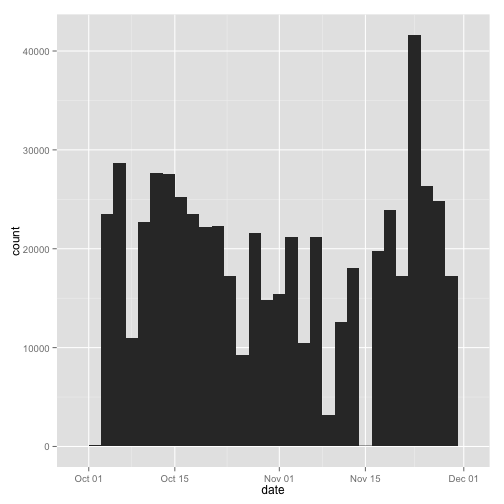
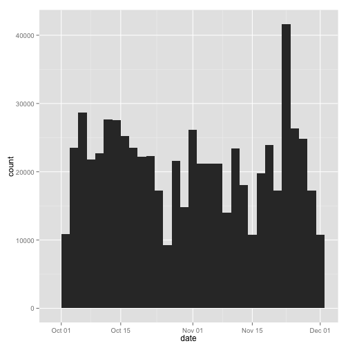

# Reproducible Research: Peer Assessment 1


## Loading and preprocessing the data

Download, extract and store the data in the `activity` data frame. Also transform the date field to `Date` format and print a sample of values to understand the data.

```r
fileUrl <- "https://d396qusza40orc.cloudfront.net/repdata%2Fdata%2Factivity.zip"
download.file(fileUrl, destfile = "Dataset.zip", method = "curl")
unzip("Dataset.zip")
activity <- read.csv("./activity.csv")
activity$date <- as.Date(activity$date)
head(activity)
```

```
##   steps       date interval
## 1    NA 2012-10-01        0
## 2    NA 2012-10-01        5
## 3    NA 2012-10-01       10
## 4    NA 2012-10-01       15
## 5    NA 2012-10-01       20
## 6    NA 2012-10-01       25
```

```r
summary(activity)
```

```
##      steps            date               interval   
##  Min.   :  0.0   Min.   :2012-10-01   Min.   :   0  
##  1st Qu.:  0.0   1st Qu.:2012-10-16   1st Qu.: 589  
##  Median :  0.0   Median :2012-10-31   Median :1178  
##  Mean   : 37.4   Mean   :2012-10-31   Mean   :1178  
##  3rd Qu.: 12.0   3rd Qu.:2012-11-15   3rd Qu.:1766  
##  Max.   :806.0   Max.   :2012-11-30   Max.   :2355  
##  NA's   :2304
```

## What is mean total number of steps taken per day?

A histogram of the total number of steps taken **each** day is calculated and shown below:


```r
library(ggplot2)
q <- qplot(date, weight = activity$steps, data = activity, geom = "histogram")
print(q)
```

```
## stat_bin: binwidth defaulted to range/30. Use 'binwidth = x' to adjust this.
```

 


Calculation of the mean and median total number of steps taken **per** day:


```r
mean(tapply(activity$steps, activity$date, sum, na.rm = TRUE))
```

```
## [1] 9354
```

```r
median(tapply(activity$steps, activity$date, sum, na.rm = TRUE))
```

```
## [1] 10395
```

## What is the average daily activity pattern?

A time series plot of the 5-minute interval and the average number of steps taken, averaged across all days:


```r
average_steps <- data.frame(cbind(activity$interval, tapply(activity$steps, 
    activity$interval, mean, na.rm = TRUE)))
colnames(average_steps) <- c("interval", "steps")
q <- ggplot(data = average_steps, aes(x = interval, y = steps)) + geom_line()
print(q)
```

 


The 5-minute interval which contains the maximum number of steps across all the days in the dataset is:


```r
maxtime <- average_steps[which.max(average_steps$steps), "interval"]
strftime(as.POSIXct(Sys.Date()) + as.difftime(round(maxtime/100), units = "hours") + 
    as.difftime(maxtime%%100, units = "mins"), "%r", tz = "UTC")
```

```
## [1] "08:35:00 AM"
```


## Imputing missing values

The total number of missing values (NAs) in the dataset is calculated below:


```r
sum(is.na(activity$steps))
```

```
## [1] 2304
```


Use the mean for 5-minute interval, to replace the missing values.


```r
fixed <- activity
fixed[is.na(fixed[, 1]), 1] <- average_steps[is.na(fixed[, 1]), 2]
```


Create a histogram of the new dataset, which has the NAs replaced with the 5-minute means.


```r
qplot(date, weight = fixed$steps, data = fixed, geom = "histogram")
```

```
## stat_bin: binwidth defaulted to range/30. Use 'binwidth = x' to adjust this.
```

 


Calculate and report the mean and media values. We can see that the values differ from the initial calculation, and have higher value. It is also observed in the graph above. Most days have an increased number of mean of steps, since the NAs have been replaced by the 5-minute interval mean.


```r
mean(tapply(fixed$steps, fixed$date, sum, na.rm = TRUE))
```

```
## [1] 10766
```

```r
median(tapply(fixed$steps, fixed$date, sum, na.rm = TRUE))
```

```
## [1] 10766
```

## Are there differences in activity patterns between weekdays and weekends?

Append "Weekend" or "Weekday" to a new field, conditionally.


```r
library(lattice)
fixed$day <- as.factor(ifelse(weekdays(fixed$date) %in% c("Saturday", "Sunday"), 
    "Weekend", "Weekday"))
```


Plot the 5-minute average of steps, by weekday/weekend.


```r
xyplot(steps ~ interval | day, aggregate(steps ~ interval + day, fixed, FUN = mean), 
    layout = c(1, 2), type = "l", group = day)
```

 

